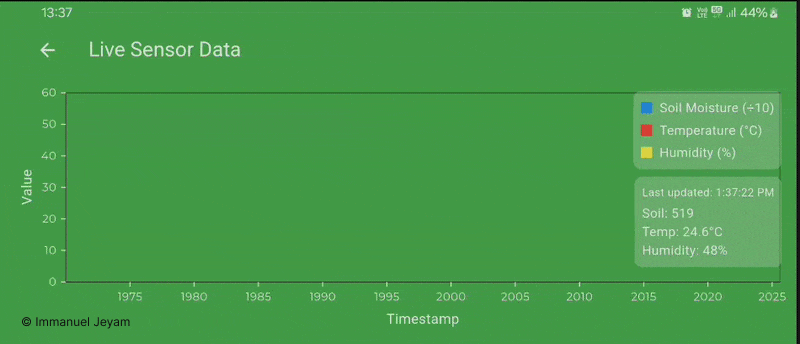

# 🌱 FertiOptimizer App

A powerful Flutter-based smart agriculture management app that helps farmers optimize fertilizer usage, monitor crops, and control irrigation remotely. The app provides real-time sensor data, weather forecasts, and AI-powered recommendations.


## 🌟 Features

- **🏠 Home Dashboard**
  - Live sensor data visualization (soil moisture, temperature, humidity)
  - Current weather and 24-hour forecast
  - Quick access to motor control
  
  

- **⚡ Real-time Optimization**
  - One-click fertilizer optimization using ML model
  - NPK level recommendations
  - Gemini API-powered analysis
  
  

- **🌦 Weather Forecast**
  - 7-day weather forecast with remarks
  - Weather alerts and recommendations
  
  

- **🚰 Irrigation Control**
  - Remote motor on/off control
  - Automatic scheduling based on soil conditions
  
  

- **📊 Analytics Dashboard**
  - Historical sensor data graphs
  - Crop health trends over time
  
  

- **💬 Multi-language Chat Support**
  - Gemini-powered chat interface
  - Regional language support for farmers
  
  
  
- **👤 Field Management**
  - Switch between multiple fields
  - View field-specific sensor data
  
  

## 🛠 Tech Stack

- 🔧 Flutter (Mobile App)
- 🐍 Python (ML Backend)
- 🌐 Node.js + Express.js (Backend)
- 🔥 MongoDB (Realtime Database)
- 🤖 Gemini API (Analysis & Chat)
- 🌦 WeatherAPI (Forecast Data)

## 📁 Folder Structure

```
├── API
│   ├── api.dart
│   ├── mlApi.dart
│   └── weather_service.dart
├── constants
│   ├── buttonOutlined.dart
│   ├── image_strings.dart
│   ├── page_indicator.dart
│   ├── sizes.dart
│   ├── spacing.dart
│   └── text_strings.dart
├── helper_functions
│   └── helper_functions.dart
├── main.dart
├── models
│   ├── ferilizer_model.dart
│   ├── nutritionData_model.dart
│   ├── sensorData_model.dart
│   ├── weatherData_model.dart
│   └── weather_model.dart
├── pages
│   ├── analytics2.dart
│   ├── analytics.dart
│   ├── home.dart
│   ├── login.dart
│   ├── settings.dart
│   └── week_screen.dart
├── popups
│   ├── fullscreen_loaders.dart
│   └── loaders.dart
├── providers
│   └── analyticsProvider.dart
├── routes.dart
├── theme
│   ├── custom_theme
│   │   └── elevated_button_theme.dart
│   └── theme.dart
└── utils
    ├── adBox.dart
    ├── analysis_box.dart
    ├── appbar.dart
    ├── CategoryItems.dart
    ├── CFC.dart
    ├── dataContainer.dart
    ├── device_utils.dart
    ├── home_container.dart
    ├── linechart.dart
    ├── npk_box.dart
    ├── productBox_L.dart
    ├── productBox_s.dart
    ├── sensor_data_box.dart
    ├── settingContainer.dart
    ├── sharedPrefs.dart
    ├── shimmerWidget.dart
    ├── TC.dart
    ├── TFD.dart
    └── weatherContainer.dart
```

## 🌐 Backend APIs (Node.js Version)

The backend is built using Node.js with Express.js, handling:

- **Sensor Data Processing**
  - REST endpoints for receiving sensor data
  - WebSocket support for real-time updates
  - Data validation and sanitization

- **Machine Learning Integration**
  - Python child processes for ML model execution
  - API endpoints for fertilizer recommendations
  - Crop-specific prediction models

- **Weather Data Integration**
  - Weather API proxy endpoints
  - Forecast data caching
  - Weather alert system

- **Device Control**
  - IoT device management endpoints
  - Motor control API
  - Irrigation scheduling system

- **Authentication & Security**
  - JWT authentication
  - Role-based access control
  - API rate limiting

## 🛠 Setup

```bash
git clone https://github.com/IMMANUEL-88/ferti_optimizer.git
cd ferti_optimizer
flutter pub get
flutter run
```
**Note**: While you can clone and run the app locally, please be aware that:
  - Some backend APIs are currently hosted on a local server (localhost), and others are hosted live.
  - To experience full functionality (ML predictions, sensor data sync, motor control, etc.), you’ll need to set up the backend environment locally or deploy it to a live server.
  - The necessary environment variables (.env) are maintained privately and are not included in the repository for security reasons.
